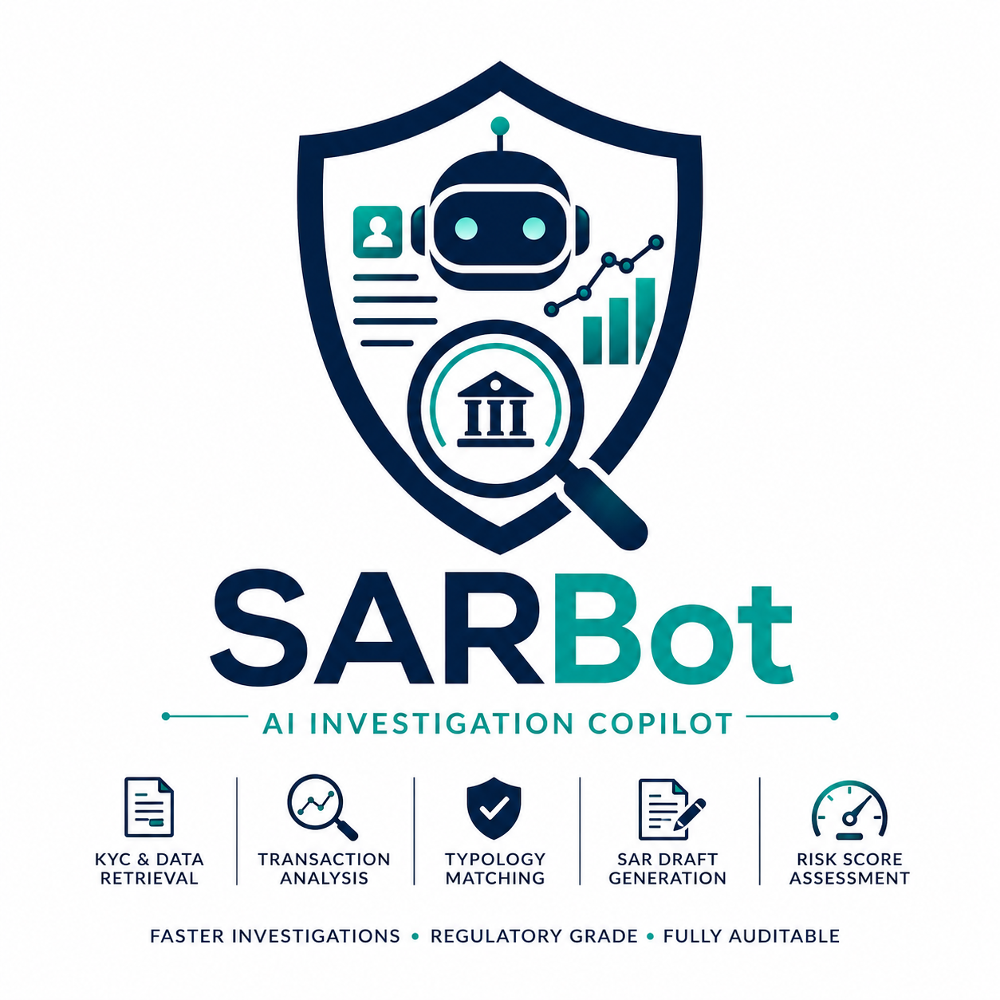

# SARBot — AI-Powered Financial Crime Investigation Copilot



> **Faster Investigations • Regulatory Grade • Fully Auditable**

SARBot is an autonomous AI agent that investigates suspicious activity alerts, gathers evidence, drafts regulatory-grade SAR (Suspicious Activity Report) narratives, and calculates risk scores — turning a multi-hour manual AML investigation into a task that completes in seconds.

Built for the HCLTech × OpenAI Hackathon using **OpenAI gpt-4o** and **Codex**.

🔗 **Live demo:** [sarbot.vercel.app](https://sarbot.vercel.app)  
📁 **GitHub:** [github.com/poonam88/sarbot](https://github.com/poonam88/sarbot)

---

## What it does

Given a case ID, customer ID, and alert type, SARBot's agent autonomously:

1. **KYC & Data Retrieval** — nationality, PEP status, occupation, risk tier, prior alerts
2. **Transaction Analysis** — amounts, counterparties, jurisdictions, flag types
3. **Typology Matching** — searches a FATF/FCA-aligned reference (structuring, layering, TBML, bulk cash)
4. **SAR Draft Generation** — regulatory-grade prose citing the evidence gathered
5. **Risk Score Assessment** — 0–100 score with recommendation (SUBMIT SAR / ESCALATE / MONITOR / DISMISS)

Every tool call is logged with input, output, and duration — giving investigators a transparent, auditable evidence trail critical for regulatory scrutiny.

---

## Why this matters

AML analysts spend 2–4 hours per case manually gathering evidence and drafting SAR narratives. This creates:
- **Investigation backlogs** — real financial crime sits unreviewed
- **Inconsistent SAR quality** — varies by analyst and workload
- **Audit risk** — reasoning lives only in someone's notes

SARBot compresses the evidence-gathering and drafting step from hours to seconds while keeping every step traceable. The analyst still reviews and approves before anything is filed.

**ROI:** ~60–80% reduction in analyst labor cost per investigation, 4–5x throughput increase per analyst.

---

## Architecture

```
React Frontend  →  FastAPI Backend  →  OpenAI gpt-4o function-calling agent
                         │
                         ▼
                    5 deterministic tools
                    (swappable for real systems)
```

### Agent loop
OpenAI gpt-4o with native function calling. Calls tools in sequence, observes results, reasons over outputs, until it returns a final structured JSON result with SAR narrative, risk score, red flags, and recommendation.

### Tools (`tools.py`)
| Tool | Purpose |
|------|---------|
| `get_customer_kyc` | Retrieve KYC profile |
| `get_transaction_history` | Pull recent transactions |
| `search_typology_database` | Match FATF/FCA typologies |
| `draft_sar_narrative` | Generate regulatory SAR prose |
| `calculate_risk_score` | Score 0–100 with recommendation |

Currently backed by realistic mock data — designed to be swapped for real KYC/transaction/case-management systems.

---

## Tech stack

| Layer | Technology |
|-------|-----------|
| AI Model | OpenAI gpt-4o — agentic function calling |
| AI IDE | OpenAI Codex — used to build and scaffold the project |
| Backend | FastAPI, Pydantic |
| Frontend | React, Vite |
| Deployment | Vercel (serverless Python + static frontend) |

---

## Project structure

```
sarbot/
  main.py                  FastAPI routes
  agent.py                 OpenAI gpt-4o agent loop
  tools.py                 5 mock tools + typology data
  models.py                Pydantic schemas
  data/
    sample_cases.json      3 demo cases
  .env.example             API key template

frontend/
  src/
    App.jsx
    assets/
      sarbot.png           Logo
    components/
      CaseList.jsx
      CaseHeader.jsx
      AgentTrace.jsx
      SARNarrative.jsx
      RiskScore.jsx
    styles.css

api/
  index.py                 Consolidated app for Vercel serverless
  requirements.txt

vercel.json                Vercel routing config
```

---

## Running locally

**Backend:**
```bash
cd sarbot
pip install -r requirements.txt

# Create .env file
echo OPENAI_API_KEY=sk-... > .env

python -m uvicorn main:app --host 127.0.0.1 --port 8000
```

**Frontend:**
```bash
cd frontend
npm install
npm run dev -- --port 3000
```

Open `http://127.0.0.1:3000`

---

## Demo flow

1. Open the dashboard → select **Meridian Trading Ltd** (highest risk case)
2. Watch the **Agent Trace** tab — see each tool call complete in real time
3. Open **SAR Draft** — editable regulatory narrative, ready to copy
4. Open **Decision** — risk score, red flags, recommendation, time taken
5. Approve or edit before submission

---

## Sample cases

| Case ID | Customer | Pattern | Risk |
|---------|----------|---------|------|
| CASE-2024-8841 | Meridian Trading Ltd | Structuring across UAE/NL/Cyprus | 100/100 |
| CASE-2024-8839 | K. Osei-Mensah | Cash deposits below threshold | 64/100 |
| CASE-2024-8835 | BlueWave Capital LP | Wire transfer pattern | 28/100 |

---

## Deployment

Deployed on Vercel with serverless Python functions + React static build.

```bash
vercel --prod
```

Set `OPENAI_API_KEY` in Vercel → Project Settings → Environment Variables.

See [DEPLOY.md](./DEPLOY.md) for full step-by-step instructions.

---

## Future roadmap

- Real-time agent trace streaming (SSE)
- Live database connections (replace mock tools)
- RAG over FATF/FCA/POCA regulatory documents
- Case status workflow (Pending → Under Review → Approved → Filed)
- Multi-agent specialization (KYC agent, transaction agent, narrative agent)
- Multi-jurisdiction support (US BSA/FinCEN, EU AMLD, APAC)

---

## Built by

**Poonam Sharma** — AI & Emerging Technology Trainer, HCLTech  
AITP Certified | HCLTech × OpenAI Hackathon Top 15

And

**Anupam Rajendra Vishwakarma** -- Senior Software Developer, GM1 CU-Modern Apps-MA-Full Stack

---

## License

MIT
